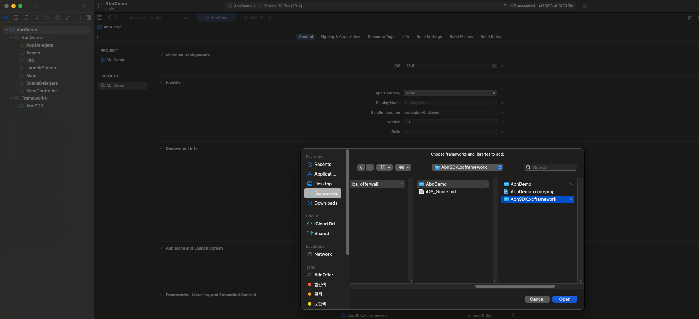
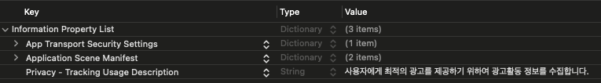
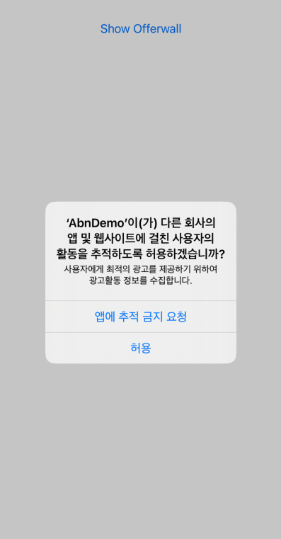
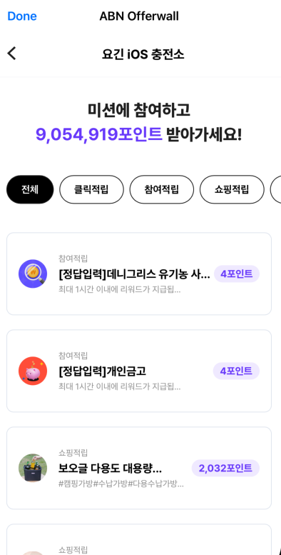

# 오퍼월 SDK 적용 가이드 (iOS)

## 1. SDK 설정하기

### 1.1 라이브러리 등록

다운로드 받은 SDK 압축파일을 풀면 AbnSDK.xcframework 폴더가 생성됩니다. AbnSDK.xcframework 폴더를 XCode 내에 마우스로 드래그합니다. 이후 XCode -> Target -> General -> Frameworks, Libraries, and Embedded Content 항목에 AbnSDK.xcframework 가 있는 것을 확인하시고 Embed 설정을 Embed & Sign 으로 변경합니다.

아래의 이미지를 참고하세요.



### 1.2 앱 추적 동의

앱 광고의 경우 유저들의 광고 참여여부를 확인하기 위해서는 사전에 앱추적동의를 받아야합니다.  앱추적동의는 iOS 14부터 제공되는 기능으로 기기의 IDFA 값 수집을 위하여 필요합니다. 앱 추적 동의 창은 가급적이면 개발하시는 앱이 시작되는 시점에 띄우는 것을 권고드립니다.  [앱 추적동의에 대하여 더 알아보기](https://developer.apple.com/kr/app-store/user-privacy-and-data-use/)

앱 추적 동의에 거부한 유저에게는 광고가 제한적으로 노출됩니다.

#### 앱 추적 동의 창 띄우기

앱 추적동의 창을 띄우기 위해서는 우선 info.plist 파일에 아래와 같이 "Privacy - Tracking Usage Description" 문구를 추가합니다.  추가한 문구는 앱 추적 동의 팝업 창에 노출됩니다.

작성 예시) 사용자에게 최적의 광고를 제공하기 위하여 광고활동 정보를 수집합니다.



아래의 API 를 호출하여 앱 추적 동의 창을 띄울 수 있습니다. [AppTrackingTransparency API 가이드 보기](https://developer.apple.com/documentation/apptrackingtransparency)

```swift
import AppTrackingTransparency

if #available(iOS 14, *) {
    ATTrackingManager.requestTrackingAuthorization { status in
                // ...
    }
 }
```



## 2. 오퍼월 띄우기

### 2.1 앱 ID 설정

SDK 사용을 위해서는 사전에 **APP-ID** 값을 발급 받으셔야합니다.

SDK 가 사용되기 전에 아래와 같이 초기화 로직을 넣습니다. 실제 **APP-ID** 값을 아래 로직의 **your-app-id** 부분에 넣어주어야합니다.

```swift
// Swift
import AbnSDK

AbnSession.shared.appId = "your-app-id"
```

### 2.2 사용자 식별값 설정

오퍼월을 띄우기 위해서는 우선 앱내에서 사용자를 식별할 수 있는 값을 SDK 에 설정하여야합니다. 사용자 식별값은 일반적으로 로그인 ID 와 같은 값이 사용됩니다. 만약 사용자 식별값이 전화번호나 이메일 등 개인 정보에 해당된다면 SHA256 과 같은 해쉬함수나 암호화 함수를 사용하여 주실것을 권장합니다.

사용자 식별값을 설정하지 않는 경우에는 오퍼월에는 광고가 출력되지 않습니다. 또한 사용자가 포인트 적립시 개발사의 서버로 호출되는 callback 내에 사용자 식별값이 같이 전달되므로 반드시 사용자 식별값을 설정하셔야합니다.

아래와 같이 호출하시어 사용자 식별값을 설정해주세요.

```swift
// Swift
import AbnSDK

AbnSession.shared.userId = "<사용자 식별값>"
```

### 2.3 AdOfferwallViewController

오퍼월을 띄우는 가장 쉬운 방법은 **AdOfferwallViewController** 를 사용하는 것입니다.  AdOfferwallViewController 는 일반적인 UIViewController 와 동일한 방법으로 사용하실 수 있습니다. 아래의 예시는 AdOfferwallViewController 를 UINavigationController 와 함께 Modal 형태로 띄우는 예시입니다.

```swift
// Swift
import AbnSDK

func showOfferwall() {
    let vc = AdOfferwallViewController()
    vc.title = "ABN Offerwall"

    let navController = UINavigationController(rootViewController: vc)
    navController.modalPresentationStyle = .fullScreen
    navController.navigationBar.titleTextAttributes = [.foregroundColor: UIColor.black]

    self.present(navController, animated: true)
}
```




#### 2.4 AdOfferwallView

오퍼월을 UIView 형태로 사용하고싶다면 **AdOfferwallView** 를 사용할 수 있습니다.  AdOfferwallView 는 UIView 동일한 방식으로 사용하실 수 있습니다. 다만 광고 목록을 불러오기 위해서는 명시적으로 loadData() 함수를 호출해야합니다. 아래의 예시는 UIViewController 내에 AdOfferwallView 를 추가하고 광고 목록을 불러오는 예시입니다.

```swift
// Swift
import AbnSDK

func loadOfferwall() {

    let offerwallView = AdOfferwallView(frame:view.frame, viewController: self)
    //offerwallView.offerwallListener = self  // 아래 OfferwallEventListener 참고

    view.addSubview(offerwallView)

    offerwallView.translatesAutoresizingMaskIntoConstraints = false
    NSLayoutConstraint.activate([
        offerwallView.leadingAnchor.constraint(equalTo: view.leadingAnchor),
        offerwallView.trailingAnchor.constraint(equalTo: view.trailingAnchor),
        offerwallView.topAnchor.constraint(equalTo: view.topAnchor),
        offerwallView.bottomAnchor.constraint(equalTo: view.bottomAnchor),
    ])

    offerwallView.loadData()

}
```

#### OfferwallEventListener

오퍼월에 광고가 로드되는 시점이나 메뉴가 클릭될 때 그 이벤트를 받아서 처리할 수 있도록 OfferwallEventListener protocol 을 제공합니다. 아래는 protocol 규약입니다.

```swift

/// 오퍼월 내의 특정 이벤트들을 받아서 처리하기 위하여 사용됩니다.
/// AdOfferwallView 객체의 offerwallListener 에 설정합니다.
@objc public protocol OfferwallEventListener: NSObjectProtocol {
    /// AdOfferwallView 에 광고가 로딩되는 시점에 호출됩니다.
    @objc optional func didAdDataLoaded()

    /// AdOfferwallView 의 광고를 클릭하면 호출됩니다.
    ///
    /// - Parameters:
    ///   - appId : 클릭한 광고의 appId
    ///   - appName : 클릭한 광고의 명칭
    @objc optional func didAdItemClicked(campaignId: Int, campaignName: String)

    /// AdOfferwallView 가 닫히는 경우 호출됩니다.
    @objc optional func didOfferwallRemoved()
}

```

AdOfferwallView.offerwallListener 또는 AdOfferwallViewController.offerwallListener 에 설정하실 수 있습니다. 사용 방법은 아래 내용을 참고하세요.

```swift
// Swift
import AbnSDK

class ViewController: UIViewController, OfferwallEventListener {

    func loadOfferwall() {

        let offerwallView = AdOfferwallView(frame:view.frame, viewController: self)
        offerwallView.offerwallListener = self  // Listener 설정

        // ...

        offerwallView.loadData()
    }

    // MARK: OfferwallEventListener

    func didAdDataLoaded() {
        print("didAdDataLoaded")
    }

    func didAdItemClicked(campaignId: Int, campaignName: String) {
        print("campaignId: \(campaignId), campaignName: \(campaignName)")
    }

    func didOfferwallRemoved() {
        print("didOfferwallRemoved")
    }
```

### 2.5 SwiftUI 에서 사용하기

SwiftUI 에서 오퍼월을 사용하실 수 있습니다. 아래의 예시 코드를 참고해주세요.

```swift
// SwiftUI

struct OfferwallViewController : UIViewControllerRepresentable {
    func makeUIViewController(context: Context) -> AdOfferwallViewController {
        AdOfferwallViewController()
    }

    func updateUIViewController(_ uiViewController: AdOfferwallViewController, context: Context) {
    }
}

struct SwiftUIView: View {
    var body: some View {
        OfferwallViewController()
    }
}

```

## 3. Publisher API

### 3.1 광고 상태 조회 - QueryPublishState

Abn 사이트의 [게시정보]에서 광고 게시 중지를 하게 되면 이후에는 사용자가 오퍼월 창을 띄워도 광고들이 나타나지 않습니다. 그러므로 향후 광고 게시를 중지할 경우를 대비하여 화면에 충전소 버튼 자체를 보이지 않게 하는 기능을 갖추는 것이 바람직합니다. 이를 위하여 현재 게시앱의 광고게시 상태를 조회하는 기능을 제공합니다.

- func **queryPublishState(completion:@escaping (Int)->Void)**
	- Parameters
		- completion: 결과를 받으면 호출됩니다. 파라메터로 게시 상태 값(Int)이 전달됩니다.
	- 사용예시

```swift
// Swift
AbnSession.sharedInstance()?.queryPublishState() {
    (state) in
    print("#### queryPublishState \(state)")
}
```

- func **queryPublishState(target:NSObject, action:Selector)**
	- Parameters
		- target: 결과를 받으면 이 객체의 action 메소드가 호출됩니다.
		- action: 결과를 받으면 호출되는 메소드입니다. 해당 메소드는 NSNumber 타입의 파라메터 1개를 가져야하며, 게시 상태 값이 전달됩니다.
	- 사용예시

```swift
// Swift

AbnSession.sharedInstance()?.queryPublishState(target: self, action: #selector(didReceivedPublishState(_:)))

@objc
func didReceivedPublishState(_ state:NSNumber) {
    print("#### queryPublishState \(state)")
}
```

### 3.2 적립가능한 포인트 조회 - queryAdvertiseCount

광고 게시 상태를 확인하여 충전소 버튼을 보이게하거나 안보이게 하는 것으로도 충분히 좋지만 현재 총 적립 가능한 포인트 등을 미리 노출한다면 보다 많은 사용자의 관심을 끌 수 있습니다. 이를 위하여 현재 적립가능한 광고 정보를 확인하는 기능을 아래와 같이 제공합니다.

- func **queryAdvertiseCount(completion:@escaping (Int,Int)->Void)**
	- Parameters
		- completion: 결과를 받으면 호출됩니다. 적립 가능한 광고 수(Int)와 포인트 합계(Int)가 파라메터로 전달됩니다.
	- 사용예시

```swift
// Swift
AbnSession.sharedInstance()?.queryAdvertiseCount() {
    (count, point) in
    print("### queryAdvertiseCount \(count) \(point)")
}
```

- func **queryAdvertiseCount(target:NSObject, action:Selector)**
	- Parameters
		- target: 결과를 받으면 이 객체의 action 메소드가 호출됩니다.
		- action: 결과를 받으면 호출되는 메소드입니다. 해당 메소드는 NSNumber 타입의 파라메터 2개를 가져야하며, 적립 가능한 광고수와 포인트 합계가 전달됩니다.
	- 사용예시

```swift
// Swift

AbnSession.sharedInstance()?.queryAdvertiseCount(target:self, action: #selector(didReceivedAdvertiseCount(_:_:)))

@objc
func didReceivedAdvertiseCount(_ count:NSNumber,  _ point:NSNumber) {
    print("### queryAdvertiseCount \(count) \(point)")
}
```

### 3.3 포인트 조회 및 인출

사용자가 적립한 포인트는 해당 앱의 서버에서 관리하는 것이 원칙입니다. 다만 자체 서버가 없는 앱을 위하여 충전소 운영에 필요한 포인트 관리 기능을 Abn 서버에서 제공합니다. 포인트를 Abn 서버에서 관리하는 경우에 아래의 API 를 사용하여 사용자의 포인트 조회나 아이템 구매 등의 기능을 구현 하실 수 있습니다.

#### 포인트 조회 - queryPoint

Abn서버에 적립되어 있는 사용자 포인트 값을 조회합니다.

- func **queryPoint(completion:@escaping (Int)->Void)**
	- Parameters
		- completion: 결과를 받으면 호출됩니다. 사용자의 보유 포인트 값이 파라메터로 전달됩니다.
	- 사용예시

```swift
// Swift
AbnSession.sharedInstance()?.queryPoint() {
    (point) in
    print("#### queryPoint \(point)")
}
```

- func **queryPoint(target:NSObject, action:Selector)**
	- Parameters
		- target: 결과를 받으면 이 객체의 action 메소드가 호출됩니다.
		- action: 결과를 받으면 호출되는 메소드입니다. 해당 메소드는 NSNumber 타입의 파라메터 1개를 가져야하며, 사용자의 보유 포인트 값이 전달됩니다.
	- 사용예시

```swift
// Swift

AbnSession.sharedInstance()?.queryPoint(target:self, action: #selector(didReceivedPoint(_:)))

@objc
func didReceivedPoint(_ point:NSNumber) {
    print("### queryPoint \(point)")
}
```

### 4. 개인정보 수집동의 여부 설정

개인정보 수집 동의 여부를 설정하는 메소드입니다. `true`로 설정하면, 오퍼월에서 개인정보 수집 동의 팝업이 표시되지 않습니다.

#### Method

```swift
AbnSession.shared.agreePrivacyPolicy = true
```